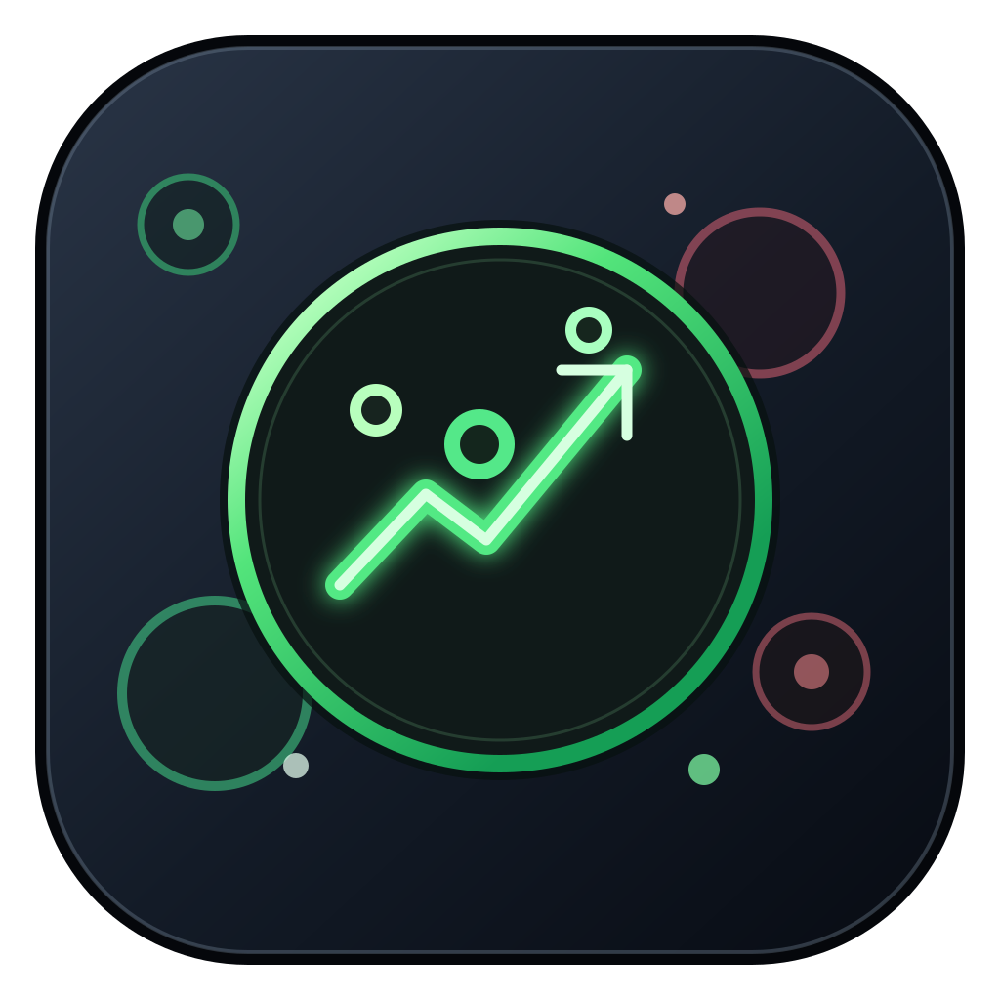

# Crypto Bubbles Wallpaper



An unofficial macOS desktop-layer app that displays the live [Crypto Bubbles](https://cryptobubbles.net/zh) bubble canvas without the page header, ads, or interactive click targets.

[Download the latest release](https://github.com/engty/crypto-bubbles-wallpaper/releases/latest) | [Chinese documentation](README.zh-CN.md)

## Install

1. Download `CryptoBubblesWallpaper-macos.zip` from the latest GitHub Release.
2. Unzip it and drag `Crypto Bubbles Wallpaper.app` into `/Applications`.
3. Open the app. It appears in the menu bar and displays the bubble canvas behind your windows.

The release is ad-hoc signed, not notarized with an Apple Developer certificate. On first launch, macOS may block it. Control-click the app, choose **Open**, and confirm once in the dialog.

## What It Does

- Loads `https://cryptobubbles.net/zh` directly inside a native `WKWebView`.
- Keeps the official page's canvas, scripts, and market-data requests intact. No price data is simulated, proxied, stored, or redrawn by this app.
- Crops the page header using a native clipping view rather than injecting layout-changing page CSS or JavaScript.
- Replaces only the site's `ads.php` response with the same empty ad-data structure expected by the page, while leaving market-data requests untouched.
- Ignores all mouse events, so bubbles cannot open a detail page or trade window.
- Provides a menu-bar control for reloading the official page or exiting the wallpaper.

The display follows the refresh cadence and aggregation method of Crypto Bubbles itself. It matches the Crypto Bubbles view, not necessarily the tick-by-tick price on any single exchange.

## Requirements

- macOS 13 Ventura or later
- Internet access to `cryptobubbles.net`

## Build From Source

```bash
git clone https://github.com/engty/crypto-bubbles-wallpaper.git
cd crypto-bubbles-wallpaper
./script/build_and_run.sh --verify
```

The script builds a self-contained app bundle at `dist/Crypto Bubbles Wallpaper.app`. It also regenerates the `.icns` icon from `Assets/AppIcon.svg`, so the release build and local build use the same asset.

## Releases

Pushing a version tag such as `v0.1.0` runs the GitHub Actions workflow on a macOS runner. The workflow embeds the tag version in the app bundle, packages it as `CryptoBubblesWallpaper-macos.zip`, generates a SHA-256 checksum, and creates a GitHub Release with both files attached.

## Disclaimer

This is an independent project and is not affiliated with, endorsed by, or supported by Crypto Bubbles. Crypto Bubbles names, data, and services belong to their respective owners. Use the app only in accordance with the website's terms of service. Nothing in this project is financial advice.

## License

[MIT](LICENSE)
